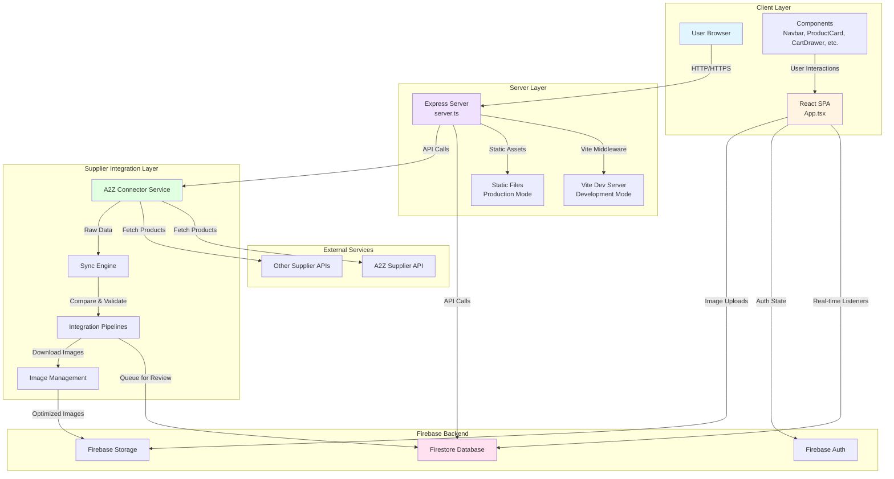
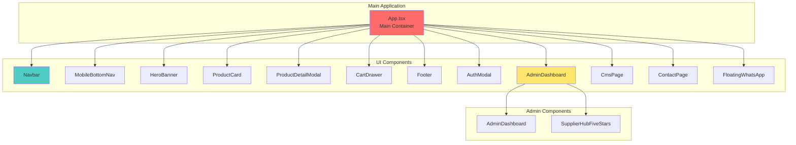
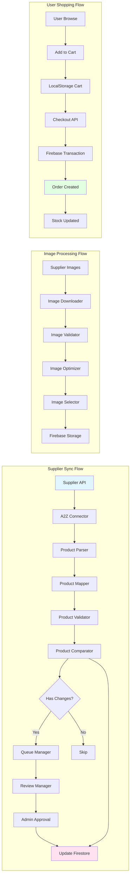
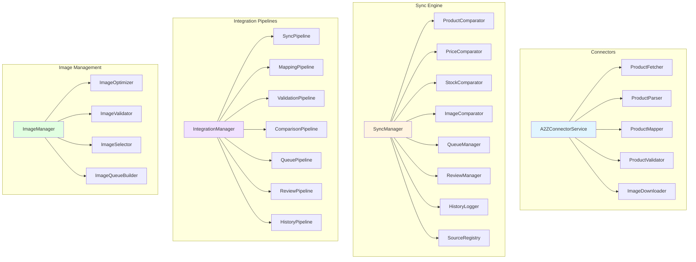
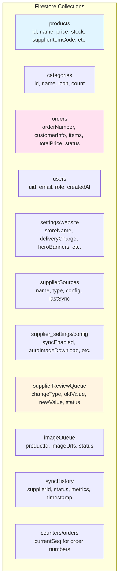
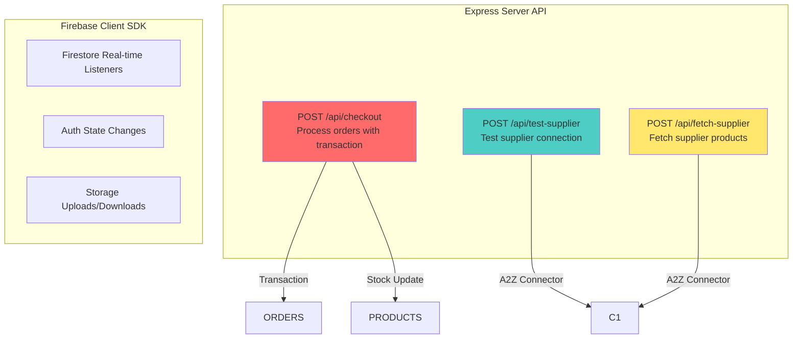

# Zyro.lk Architecture Diagram

## High-Level Architecture

## Component Architecture

## Data Flow Architecture

## Service Layer Architecture

## Database Schema

## API Endpoints

## Technology Stack

### Frontend
- **React 19** - UI framework
- **TypeScript** - Type safety
- **Vite** - Build tool and dev server
- **TailwindCSS** - Styling
- **Motion** - Animations
- **Lucide React** - Icons
- **Recharts** - Charts (for admin dashboard)

### Backend
- **Express.js** - Server framework
- **Firebase Admin SDK** - Server-side Firebase operations
- **Sharp** - Image processing

### Database & Services
- **Firestore** - NoSQL database
- **Firebase Auth** - Authentication
- **Firebase Storage** - File storage
- **A2Z Supplier API** - External product source

### Build Tools
- **esbuild** - Fast bundler
- **tsx** - TypeScript execution
- **TypeScript** - Compiler

## Key Features

1. **Multi-Supplier Integration**
   - A2Z website connector with authentication
   - Extensible connector architecture for other suppliers
   - Product parsing, mapping, and validation

2. **Sync Engine**
   - Automated product synchronization
   - Change detection (price, stock, images, descriptions)
   - Human-in-the-loop review queue
   - Sync history and metrics

3. **Image Management**
   - Automatic image downloading
   - Image optimization and validation
   - Smart image selection
   - Firebase Storage integration

4. **E-commerce Features**
   - Product catalog with categories
   - Shopping cart with localStorage persistence
   - Secure checkout with Firebase transactions
   - Order management and tracking
   - District-based delivery pricing

5. **Admin Dashboard**
   - Product management
   - Order management
   - Supplier hub for integration management
   - CMS for pages
   - Website settings configuration
   - Analytics and reporting

6. **User Experience**
   - Responsive design (mobile-first)
   - Real-time updates via Firestore
   - WhatsApp integration for customer support
   - Wishlist functionality
   - Advanced filtering and search

## Security Features

- Firebase Authentication for admin access
- Firestore security rules
- Transaction-based checkout to prevent race conditions
- Server-side API proxy to bypass CORS
- Environment-based configuration
